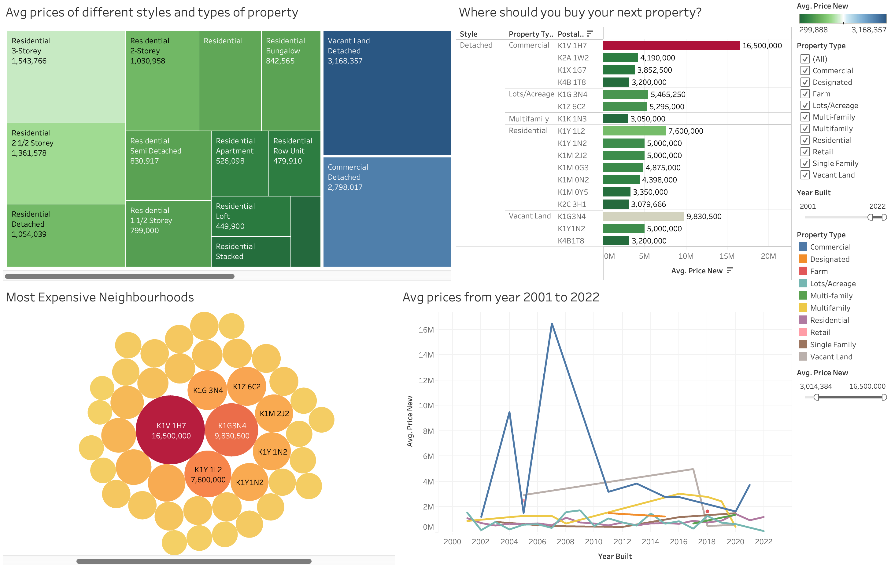

# EDA of Ottawa Real Estate Data

## Overview
Following dataset shows the dreal estate trend in Ottawa from the year 1847 to 2022.
## Description
Pre-processing and analysis of the Ottawa real estate dataset. The dataset contains information about how different types of attributes like number of bedrooms, bathrooms, garage, walkscore has an impact on the prices of the houses in Ottawa

## [Dashboard](https://public.tableau.com/app/profile/aakansha.goyal/viz/ElectricVehiclePopulationinWashington/ElectricVehiclePopulationinWashington)

### [Data Source](https://public.tableau.com/app/profile/aakansha.goyal/viz/OttawaRealEstate/OttawaRealEstateDashboard?publish=yes)
